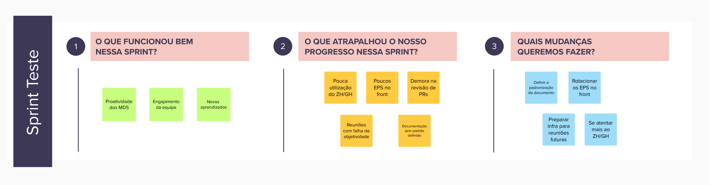
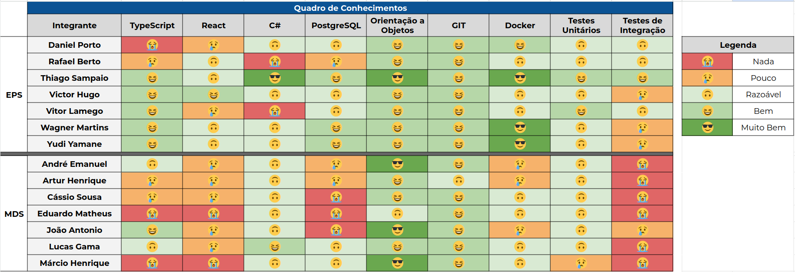

# Sprint Teste

- Data de início: 07/10/2023
- Data de término: 13/10/2023

## 1. Objetivos da Sprint

- Familiarizar os integrantes com os rituais adotados;
- Treinar os integrantes sobre os padrões e práticas para a contribuição;
- Continuar as melhorias em andamento;
- Continuar as validações do Lean Inception;
- Iniciar refatorações do front-end.

## 2. Atividades da Sprint
| Tarefa | Responsáveis |
|---|---|
|Criação do EVM| Thiago|
|Adicionar ORM Entity Framework UsuarioService| Daniel Porto |
|Adicionar ORM Entity Framework UPSSErvecie| Yudi |
|Adicionar ORM Entity Framework EscolaService | Thiago |
|Configuração do Sonar| Thiago e Wagner |
|Dockerização dos ambientes| Wagner |
|Criação da EAP | Daniel Porto e Yudi |
|Refatorar a disposição de pastas do front| Victor Hugo e Lucas Bottino|
|Refatorar comunicação com a api | Victor Hugo, Jõao e Márcio|
|Criação de componentes do front| Vitor Lamego, Cássio e André|
|Backlog do produto e Roadmap| Daniel Porto e Yudi |
|Validação das personas e jornadas | Daniel Porto |
|Validação do Sequenciador| Rafael |
|Plano de qualidade| Rafael |
|Plano de Riscos | Rafael e Victor Hugo |
|Ajustar o protótipo de alta fidelidade| Vitor Lamego, Artur e Eduardo|

## 3. Resultados

&emsp;&emsp;A Sprint Teste foi finalizada e cumpriu o seu propósito de familiarizar os integrantes com o processo. Todos os rituais foram realizados, as dúvidas foram tiradas e a avaliação foi que o plano está adaptado para se prosseguir com o projeto.

### 3.1 Tarefas finalizadas:
- Validação do Sequenciador;
- Plano de qualidade;
- Plano de Riscos;
- Configuração do sonar.

## 4. Retrospectiva

## 5. Quadro de conhecimentos

## Versionamento

| Data | Modificação | Autor |
|---|---|---|
|18/10/2023|Criação do documento|Daniel Porto|
