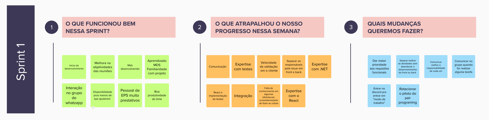
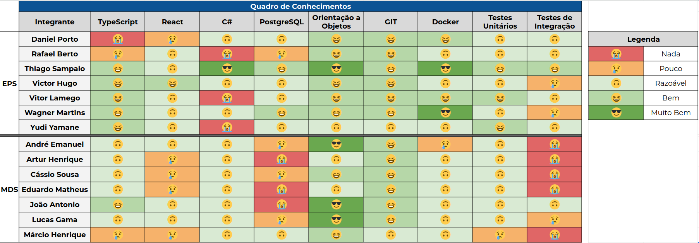

# Sprint 1

- Data de início: 14/10/2023
- Data de término: 23/10/2023

## 1. Objetivos da Sprint

- Começar as discusões sobre a US06;
- Desenvolver a US01;
- Começar a desenvolver a US02;
- Implementar as melhorias do Design system do governo;
- Realizar o fechamento da Release 1;
- Montar a apresentação da Release 1;
- Terminar a documentação para a Release 1.

## 2. Atividades da Sprint
| Tarefa | Responsáveis |
|---|---|
|Autenticação e autorização no sistema|Thiago, Cassio e André|
|US01 - Gerenciar perfis|Daniel Porto, Thiago, Victor Hugo, Eduardo, Artur|
|US02 - Gerenciar os diferentes tipos de usuários do sistema| Rafael, Yudi, Lucas |
|Criação do EVM| Daniel e Rafael|
|Adicionar ORM Entity Framework UsuarioService| Daniel Porto |
|Adicionar ORM Entity Framework UPSSErvecie| Yudi |
|Adicionar ORM Entity Framework EscolaService | Thiago |
|Dockerização dos ambientes| Wagner |
|Criação da EAP | Daniel Porto e Yudi |
|Refatorar a disposição de pastas do front| Victor Hugo e Lucas Bottino|
|Refatorar comunicação com a api | Victor Hugo, Jõao e Márcio|
|Criação de componentes do front| Vitor Lamego, Cássio e André|
|Backlog do produto e Roadmap| Daniel Porto e Yudi |
|Validação das personas e jornadas | Daniel Porto |
|Ajustar o protótipo de alta fidelidade| Vitor Lamego, Artur e Eduardo|
|Atualizar o andamento na Wiki|Daniel Porto|

## 3. Resultados

&emsp;&emsp;O fim da Sprint 1 sofreu um pequeno adiamento resultante do atrazo relacionado ao fechamento da Release 1. A equipe optou por finalizar a sprint após a apresentação no dia 23/10.

### 3.1 Tarefas finalizadas:

- Autenticação e autorização no sistema;
- Criação do EVM;
- Adicionar ORM Entity Framework UsuarioService;
- Adicionar ORM Entity Framework UPSSErvecie;
- Adicionar ORM Entity Framework EscolaService;
- Dockerização dos ambientes;
- Criação da EAP;
- Backlog do produto e Roadmap;
- Validação das personas e jornadas;
- Ajustar o protótipo de alta fidelidade;
- Atualizar o andamento na Wiki.

## 4. Retrospectiva

## 5. Quadro de conhecimentos

## Versionamento

| Data | Modificação | Autor |
|---|---|---|
|28/10/2023|Criação do documento|Daniel Porto|
