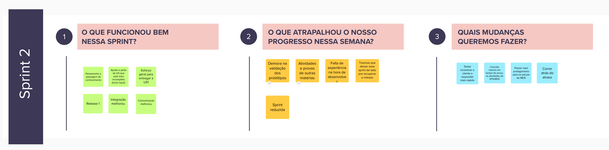
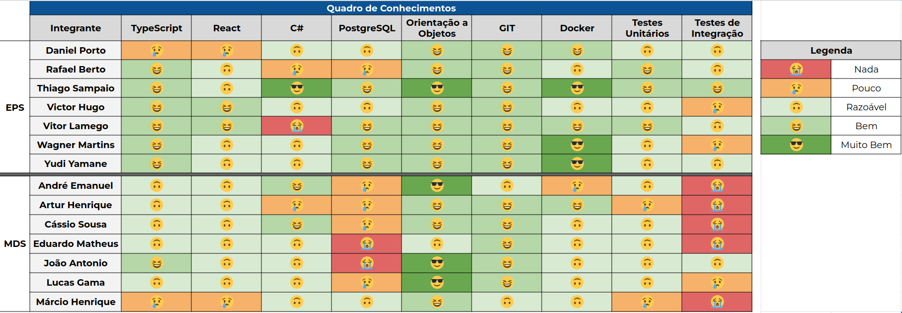

# Sprint 2

- Data de início: 23/10/2023
- Data de término: 28/10/2023

## 1. Objetivos da Sprint

- Desenvolver a US03;
- Prototipar as US04 e US06;
- Finalizar a US01;
- Desenvolver a US02;
- Finalizar as melhorias do Design system do governo;
- Realizar o fechamento da Release 1.0.1;

## 2. Atividades da Sprint
| Tarefa | Responsáveis |
|---|---|
|US01 - Gerenciar perfis|Daniel Porto, Thiago, Victor Hugo, Eduardo, Artur|
|US02 - Gerenciar os diferentes tipos de usuários do sistema| Rafael, Yudi, Lucas|
|Refatorar a disposição de pastas do front| Victor Hugo e Lucas Bottino|
|Refatorar comunicação com a api | Victor Hugo, Jõao e Márcio|
|Criação de componentes do front| Vitor Lamego, Cássio e André|
|US03 - Gerenciar empresas terceirizadas|Wagner, Cassio e Márcio|
|US04 - Ranking de escolas|Yudi, Thiago, Eduardo e Artur|
|US06 - Menor custo logístico para um conjunto de ações| Victor Hugo, André e João|

## 3. Resultados

&emsp;&emsp;A sprint 2 foi reduzida devido ao ajuste na data final da sprint 1. Devido à não entrega da US01, a release 1 ficou sem nenhum valor de negócio atribuída, dessa forma, essa sprint fechou a release 1.0.1 para incluir a funcionalidade da US01, bem como as melhorias referentes ao design system do governo.

### 3.1 Tarefas finalizadas:

- US01 - Gerenciar perfis;
- Criação de componentes do front;

## 4. Retrospectiva

## 5. Quadro de conhecimentos

## Versionamento

| Data | Modificação | Autor |
|---|---|---|
|28/10/2023|Criação do documento|Daniel Porto|
