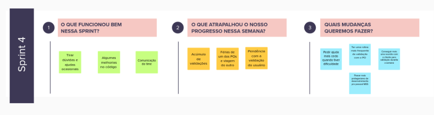
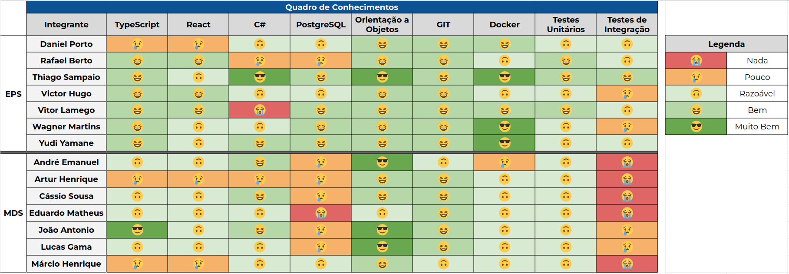

# Sprint 4

- Data de início: 03/11/2023
- Data de término: 10/11/2023

## 1. Objetivos da Sprint

- Validar e Desenvolver a US03;
- Continuar as US04 e US06;
- Revalidar a US08;
- Configurar o deploy contínuo;
- Iserir mais melhorias.

## 2. Atividades da Sprint
| Tarefa | Responsáveis |
|---|---|
|US03 - Gerenciar empresas terceirizadas|Wagner, Cassio e Márcio|
|US04 - Ranking de escolas|Yudi, Thiago, Eduardo e Artur|
|US06 - Menor custo logístico para um conjunto de ações| Victor Hugo, André e João|
|US08 - Gerenciar ações| Daniel Porto, Vitor Lamego, Lucas e João|
|Deploy contínuo| Wagner, Thiago, André e Eduardo|
|Correção do bug de paginação | Rafael |
|Mensagem de erro ao cadastrar email já registrado|Yudi e Márcio|
|Refatorar a disposição de pastas do front| Victor Hugo e Lucas Bottino|
|Refatorar comunicação com a api | Victor Hugo, Jõao e Márcio|

## 3. Resultados

&emsp;&emsp;

### 3.1 Tarefas finalizadas:

- Deploy contínuo;
- Mensagem de erro ao cadastrar email já registrado;
- Refatorar a disposição de pastas do front;
- Refatorar comunicação com a api.

## 4. Retrospectiva

## 5. Quadro de conhecimentos

## Versionamento

| Data | Modificação | Autor |
|---|---|---|
|16/11/2023|Criação do documento|Daniel Porto|
|22/11/2023|Atualização do documento| Rafael|
