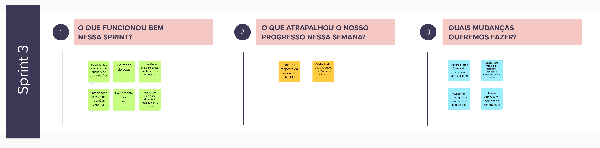
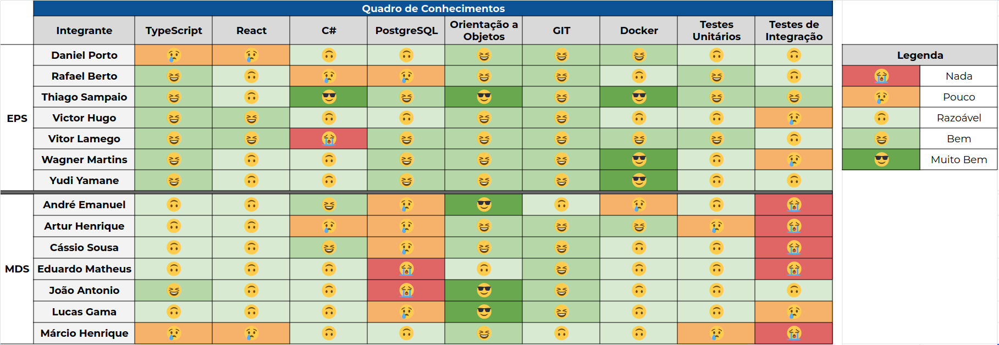

# Sprint 3

- Data de início: 17/11/2023
- Data de término: 24/11/2023

## 1. Objetivos da Sprint

- Desenvolver a US03;
- Começar a Desenvolver as US04 e US06;
- Começar a Desenvolver a US08;
- Resolver os bugs do footer e do email já cadastrado;
- Configurar o deploy contínuo.

## 2. Atividades da Sprint
| Tarefa | Responsáveis |
|---|---|
|US03 - Gerenciar empresas terceirizadas|Wagner, Cassio e Márcio|
|US04 - Ranking de escolas|Yudi, Thiago, Eduardo e Artur|
|US06 - Menor custo logístico para um conjunto de ações| Victor Hugo, André e João|
|US08 - Gerenciar ações| Daniel Porto, Vitor Lamego, Lucas e João|
|Deploy contínuo| Wagner, Thiago, André e Eduardo|
|Mensagem de erro ao cadastrar email já registrado|Yudi e Márcio|
|Footer não responsivo|Vitor Lamego e Cassio|
|US02 - Gerenciar os diferentes tipos de usuários do sistema| Rafael, Yudi, Lucas|
|Refatorar a disposição de pastas do front| Victor Hugo e Lucas Bottino|
|Refatorar comunicação com a api | Victor Hugo, Jõao e Márcio|

## 3. Resultados

&emsp;&emsp;A sprint foi teve um relativo prejuízo devido ao ritmo empregado pela equipe que não foi possível ser acompanhado pela validação dos POs. Dessa forma, foram atacadas algumas tarefas de melhorias e correções de bugs, além das USs já validadas.

### 3.1 Tarefas finalizadas:

- US02 - Gerenciar os diferentes tipos de usuários do sistema;
- Footer não responsivo;

## 4. Retrospectiva

## 5. Quadro de conhecimentos

## Versionamento

| Data | Modificação | Autor |
|---|---|---|
|16/11/2023|Criação do documento|Daniel Porto|
