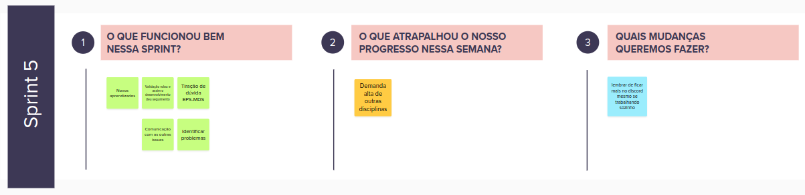
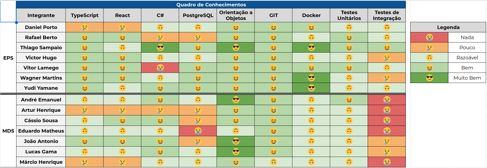

# Sprint 5

- Data de início: 11/11/2023
- Data de término: 17/11/2023

## 1. Objetivos da Sprint

- Finalizar US03, US04 e US06;
- Começar a Desenvolver a US08;
- Resolver os bugs do footer e do email já cadastrado;
- Realizar o fechamento da Release 2 (USs 2, 3, 4 e 6);

## 2. Atividades da Sprint
| Tarefa | Responsáveis |
|---|---|
|US03 - Gerenciar empresas terceirizadas|Wagner, Cassio e Márcio|
|US04 - Ranking de escolas|Yudi, Thiago, Eduardo e Artur|
|US06 - Menor custo logístico para um conjunto de ações| Victor Hugo, André e João|
|US08 - Gerenciar ações| Daniel Porto, Vitor Lamego, Lucas e João|
|Corrigir bug de seleção do tamanho da pagina| Rafael|

## 3. Resultados

&emsp;&emsp;O desenvolvimento das US03, US04 e US06 foram finalizados e mandados para aceitação na forma da Release 2. Devido a falta de resposta sobre a US08 a mesma foi realocada para a release seguinte.

### 3.1 Tarefas finalizadas:

- US03 - Gerenciar empresas terceirizadas;
- US04 - Ranking de escolas;
- US06 - Menor custo logístico para um conjunto de ações;
- Corrigir bug de seleção do tamanho da pagina;
- Release 2.

## 4. Retrospectiva

## 5. Quadro de conhecimentos

## Versionamento

| Data | Modificação | Autor |
|---|---|---|
|16/11/2023|Criação do documento| Daniel Porto |
|21/11/2023|Atualização do documento| Rafael |
|23/11/2023|Atualização do documento| Daniel Porto |
|23/11/2023|Correção do documento| Daniel Porto |
