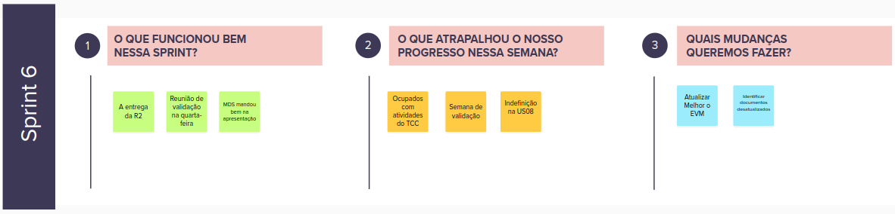
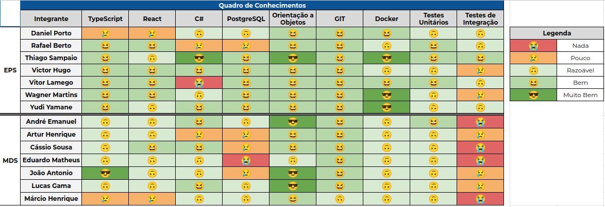

# Sprint 6

- Data de início: 18/11/2023
- Data de término: 24/11/2023

## 1. Objetivos da Sprint

- Corrigir o solicitadoa para a US03;
- Começar a Desenvolver a US08;
- Implementar melhorias sugeridas na aceitação das USs;
- Corrigir o bug conhecido dos jobs do ranking;
- Validar e iniciar as US05, US07, US09 e US11.

## 2. Atividades da Sprint

| Tarefa | Responsáveis |
|---|---|
|US03 - Gerenciar empresas terceirizadas| Wagner, Cassio e Márcio |
|US05 - Configurar pesos dos fatores de priorização| Wagner, Cassio e Márcio |
|US07 - Gerenciar solicitações de ações| Rafael e Yudi |
|US08 - Gerenciar ações| Daniel Porto, Vitor Lamego, Lucas e João|
|US09 - Exportar dados| Thiago e Eduardo |
|US11 - Menor custo logístico para um conjunto de ações| Victor Hugo, Artur e André|
|Marcar reunião extra de validação com os clientes| Rafael |
|[Melhoria] Trocar texto no modal de detalhes da escola na página de ranque de escolas| Yudi |
|[BUG] Às vezes o ranque não finaliza| Yudi |

## 3. Resultados

&emsp;&emsp; Visto a demora e impedimentos de validação com o cliente, marcou-se uma reunião extra de validação com o cliente toda quarta de 11:30 ao 12:00. Essa nova reunião foi fundamental para o avanço do desenvolvimeno nessa etapa final do desnvolvimento do projeto. Além de esclarecer dúvidas sobre as USs novos requisitos foram elicitados que o cliente não tinha refletido sobre anteriormente. Essa reunião mitigou a demora ocasional de 1 semana na validação do protótipo de uma US, fundamental para o desenvolvimento das features.

&emsp;&emsp; Além disso, fez-se a correção da US3 após a rejeição do cliente da US3. Na versão anterior dessa US, era possível cadastrar uma empresa sem o CNPJ. Isso quebra a implementação do banco de dados e impossibilitava que essa empresa fosse apagada além de permir o cadastro de dados inconsistentes. Assim, gerou-se um novo formulário de teste de aceitação.

### 3.1 Tarefas finalizadas:

- Correções da US03;
- [Melhoria] Trocar o texto no modal de detalhes.
- Marcação da reunião extra de validação

## 4. Retrospectiva

## 5. Quadro de conhecimentos

## Versionamento

| Data | Modificação | Autor |
|---|---|---|
|23/11/2023|Criação do documento| Daniel Porto |
|23/11/2023|Ajustes do documento| Rafael |
