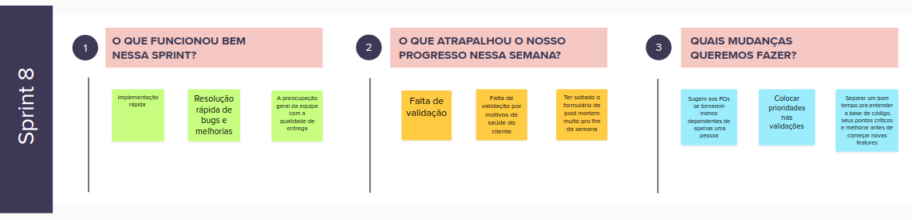
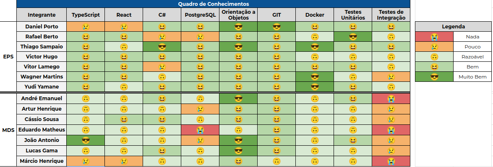

# Sprint 8

- Data de início: 25/11/2023
- Data de término: 01/12/2023

## 1. Objetivos da Sprint

- Esclarecer dúvidas e Continuar o desenvolvimento das US08 e US05;
- Esclarecer dúvidas e finalizar o desenvolvimento das US07, US09 e US11;
- Corrigir o bug conhecido dos jobs do ranking.

## 2. Atividades da Sprint

| Tarefa | Responsáveis |
|---|---|
|US05 - Configurar pesos dos fatores de priorização| Wagner, Cassio e Márcio |
|US08 - Gerenciar ações| Daniel Porto, Vitor Lamego, Lucas e João|
|US10 - Visualização de escolas pelo Google Maps | Thiago |
|US11 - Menor custo logístico para um conjunto de ações| Victor Hugo, Artur e André|
|Melhorias US7| Rafael e Yudi |
|Melhorias US9| Thiago e Eduardo |
|[BUG] Às vezes o ranque não finaliza| Yudi |

## 3. Resultados

&emsp;&emsp; Os clientes não compareceram para a reunião extra de quarta-feira. Então as melhorias realizas foram baseadas apenas nas observações dos clientes na reunião de acompanhamento na segunda-feira

### 3.1 Tarefas finalizadas:

- Melhorias US07;
- Melhorias US09;
- US05;
- US10;
- US11;

## 4. Retrospectiva

## 5. Quadro de conhecimentos

## Versionamento

| Data | Modificação | Autor |
|---|---|---|
|09/12/2023|Criação do documento| Rafael Berto |
