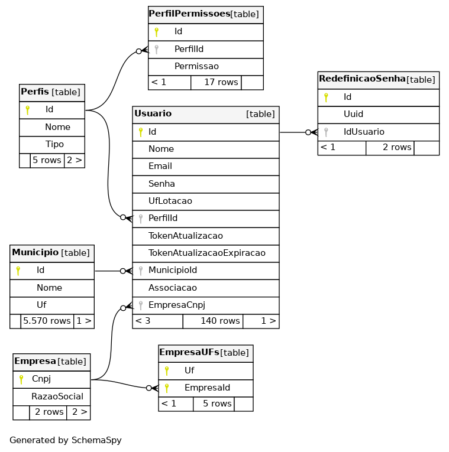
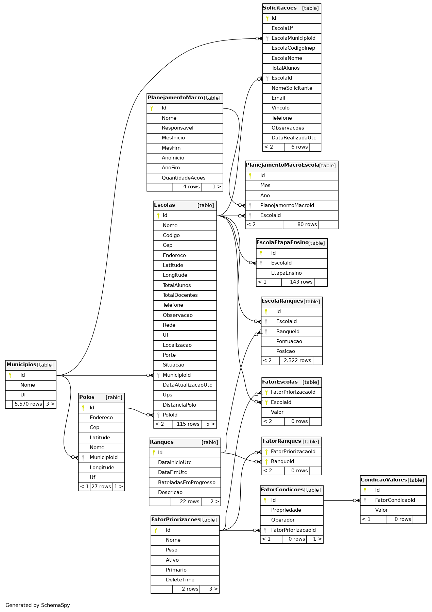

# Documento de Arquitetura

## Introdução

Este documento tem como objetivo detalhar a arquitetura do projeto e a visão de dados, apresentando uma visão geral do projeto, as tecnologias utilizadas e a visão de dados.

Através desse documento, é possível obter um melhor entendimento da arquitetura do projeto, permitindo ao leitor a compreensão do funcionamento do sistema e as abordagens utilizadas para o seu desenvolvimento.

### Visão Geral
Este documento está estruturado da seguinte forma: - Introdução - Tecnologias - Representação Arquitetural - Visões do Sistema - Referências - Versionamento

## Tecnologias

### PostgreSQL
O PostgreSQL é um SGBD objeto-relacional que suporta grande parte do padrão SQL e disponibiliza recursos modernos, como chaves estrangeiras, triggers e consultas complexas. Uma de suas principais vantagens é o fato de ser uma ferramenta de código aberto que pode ser usada para fins privados, comerciais e acadêmicos.

### .NET
O ASP.NET, utilizado para o back-end da aplicação, é um framework de código aberto que permite a criação de serviços usando .NET e C#. É um framework rápido, escalonável e seguro, que possui recursos internos de proteção contra ameaças de segurança. Além disso, o fato da instituição cliente já estar familiarizada com .NET foi determinante para a escolha dessa tecnologia, a fim de facilitar a futura manutenção do software.

### xUnit
Para os testes do back-end foi escolhido o xUnit, uma ferramenta gratuita de código aberto com foco em testes unitários para aplicações .NET. É muito utilizada por ser simples, extensível e compatível com ferramentas de execução de teste.

### React
O React é uma biblioteca Javascript altamente flexível que permite a construção de interfaces de usuário interativas e responsivas. A construção das aplicações é feita por meio de componentes que possibilitam uma alta reutilização de código.

### Jest
Para os testes do front-end será usado o Jest, um framework de testes em Javascript simples, rápido e seguro. Permite escrever testes com uma API acessível, bem documentada e forncece relatórios de cobertura de código.

## Representação Arquitetural

A arquitetura do projeto consiste no front-end e 3 microsserviços no back-end, sendo o primeiro para a gestão dos usuários, o segundo para a gestão das escolas e o terceiro para lidar com os cálculos e cadastros necessários para o cálculo do UPS (Unidade Padrão de Severidade).

### Frontend (React)

O Frontend é a aplicação que o usuário acessa diretamente. `React` é uma biblioteca Javascript que permite a criação de interfaces de usuário interativas e responsivas atráves de componentes que permitem o reuso de código.

### Microsserviços

Microsserviços são um estilo de arquitetura em que um conjunto de serviços se comunicam por meio de APIs mais leves. Essa forma de construir aplicações permite a separação de responsabilidades entre os diferentes componentes de um sistema, tornando-os independentes e mais escaláveis, além de facilitar a manutenção e evolução do software.

#### UsuarioService

Microsserviço para autenticação e autorização dos usuários.

#### EscolaService

Microsserviço responsável pelas funcionalidades relacionadas ao cáculo de ranque
de escolas, configuração de prioridades, gerência de escola, de polos e etc.

#### UpsService

Microsserviço responsável pelas funcionalidades relacionadas à 
gerência de sinistros, de rodovias e cálculo de UPS de escolas.

### Banco de Dados (PostgreSQL)

O PostgreSQL é um SGBD (Sistema Gerenciador de Banco de Dados) de código aberto. Cada microsserviço se comunicará com um banco de dados respectivo - o UsuarioService se comunicará com o UsuarioDB, por exemplo. Os diferentes bancos de dados têm flexibilidade quanto a ficarem em uma instância ou múltiplas instâncias do SGBD.

## Visões do Sistema

### Modelagem de Dados

A modelagem de dados é um processo fundamental na área de gerenciamento de informações. Envolve a criação de representações estruturadas que descrevem entidades, relacionamentos e atributos dos dados, permitindo uma compreensão clara e organizada dos mesmos. Através da modelagem de dados, é possível criar diagramas que retratam de forma visual como os dados estão relacionados entre si, facilitando a análise, a tomada de decisões e o desenvolvimento de sistemas de informação eficientes. Os diagramas a seguir apresentam a organização dos dados em seus respectivos bancos de dados.

### Visão de Implementação

A visão de implementação tem como objetivo descrever a implementação física de informações geradas pelo programa de software em componentes de hardware e é utilizada no fluxo de trabalho de Análise & Design. Essa visão ilustra a distribuição do processamento em um conjunto de nós do sistema, incluindo a distribuição física dos processos e threads. Durante cada iteração do processo de desenvolvimento, essa visão é refinada para mostrar de forma mais clara a distribuição física do processamento no sistema. As caixas tridimensionais conhecidas como nódulos (nós), representam os elementos básicos de software ou hardware, ou nódulos no sistema. As linhas de nódulo a nódulo indicam relacionamentos e as formas menores contidas dentro das caixas representam os artefatos de software empregados. O diagrama de implementação pode ser visto a seguir.

### Visão Lógica

A visão lógica do sistema se concentra na estruturação do sistema em unidades de implementação, como pacotes, classes e interfaces. Nessa visão, é possível identificar as dependências entre esses elementos, bem como as realizações de interface e os relacionamentos parte-todo, entre outras relações relevantes para a estruturação lógica do sistema. O diagrama lógico de dados (DLD) apresentado ao final deste documento representa essa visão.

### ME-R (Modelo Entidade-Relacionamento)

O ME-R representa o banco de dados em um nível conceitual. Nele trazemos as representações de nossas entidades, os atributos de cada uma delas e, por fim, cada relacionamento existente entre as entidades. Isso permite visualizar como os dados estão organizados e como as entidades se relacionam no sistema de informações.

### DE-R (Diagrama Entidade-Relacionamento)

O DE-R baseia-se no ME-R e traz uma representação, no formato de diagrama, sobre as entidades, os atributos e os relacionamentos. Esse diagrama fornece uma visão um pouco mais próxima do nível lógico. Ele descreve as entidades (objetos do mundo real), seus atributos (características) e os relacionamentos entre as entidades. Os retângulos representam as entidades, as elipses indicam os atributos, losangos que indicam o relacionamento e as linhas conectam as entidades para mostrar como elas se relacionam. O DER é uma ferramenta fundamental para visualizar e planejar a estrutura de um banco de dados antes da implementação, ajudando a definir como os dados são armazenados e acessados.

### DLD (Diagrama Lógico de Dados)

O DLD serve para especificar a um nível mais lógico as entidades, cada atributo com seus tipos (literal, inteiro, por exemplo), bem como os relacionamentos e as chaves de cada entidade - primárias ou estrangeiras. É uma representação gráfica que ilustra a estrutura lógica de um banco de dados, ele funciona como uma representação visual que orienta a implementação efetiva do banco de dados.

<!-- #### Usuários

#### Escolas

#### UPS (Rodovias e Sinistros)

 -->

## Referências

> EQUIPE DNIT 2023-1. Documento de arquitetura. Disponível em: <https://fga-eps-mds.github.io/2023-1-Dnit-DOC/projeto/arquitetura/>. Acesso em: 20/10/2023.

> O que é arquitetura de microsserviços?. Disponível em: <https://www.redhat.com/pt-br/topics/microservices/what-are-microservices>. Acesso em: 20/10/2023.

> ASP.NET. Disponível em: <https://dotnet.microsoft.com/pt-br/apps/aspnet>. Acesso em: 10/12/2023.

> Jest. Disponível em: <https://jestjs.io/pt-BR/>. Acesso em: 10/12/2023.

> PostgreSQL. Disponível em: <https://www.postgresql.org/>. Acesso em: 10/12/2023.

> React. Disponível em: <https://react.dev/>. Acesso em: 10/12/2023.

> xUnit. Disponível em: <https://xunit.net/>. Acesso em: 10/12/2023.

> Visão de Implementação. Disponível em: <https://www.cin.ufpe.br/~gta/rup-vc/core.base_rup/guidances/concepts/deployment_view_64CB74A6.html>. Acesso em: 10/12/2023.

> Diagrama de Implementação. Disponível em: <https://www.lucidchart.com/pages/pt/o-que-e-diagrama-de-implementacao-uml>. Acesso em: 10/12/2023.

> Visão Arquitetural. Disponível em: <https://www.trt9.jus.br/pds/pdstrt9/guidances/guidelines/architectural_view_FF6EDA37.html#:~:text=Vis%C3%A3o%20L%C3%B3gica%3A%20Descreve%20como%20o,todo%20e%20assim%20por%20diante.>. Acesso em: 10/12/2023.

> Diagrama Relacional. Disponível em: <https://unbarqdsw2022-1.github.io/2022.1_G1_FGAvisos/#/Modelagem/2.1.2.6.DiagramaDeBancos>. Acesso em: 10/12/2023.

## Versionamento

|**Data**|**Descrição**|**Autor(es)**|
|--------|-------------|--------------|
| 20/10/2023 | Criação do documento | Wagner Martins |
| 22/10/2023 | Revisão | Thiago |
| 22/10/2023 | Adição da Visão de dados | Wagner Martins |
| 10/12/2023 | Adição das Tecnologias utilizadas | Victor Hugo |
| 10/12/2023 | Adição da Visão de Implementação | Victor Hugo |
| 10/12/2023 | Adição das Visões do Sistema | Victor Hugo |