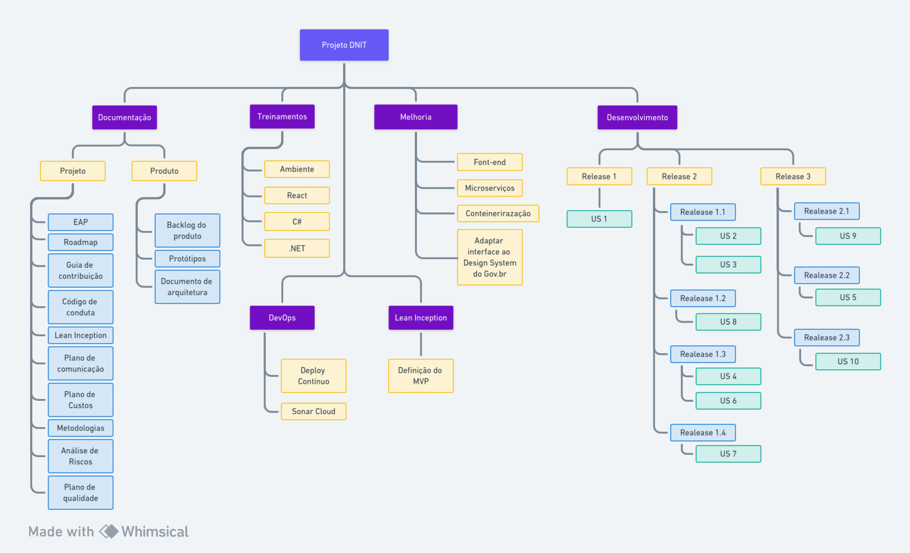

# Estrutura Analítica do Projeto

## 1. Introdução

Segundo o PMBOK, a Estrutura Analítica do Projeto (EAP) subdivide o projeto em 
partes menores, unidades de trabalho que devem ser entregues pela equipe 
(também conhecidos como entregáveis). 
Assim, a EAP também define o escopo total do projeto.

A EAP apresenta esses entregáveis de forma hierárquica, sendo cada nível mais 
específico e detalhado que o anterior. Os níveis superiores agrupam os
entregáveis nos níveis mais inferiores.

## 2. Diagrama

Segue o diagrama da EAP na Figura 1.

Para melhor visualização, é possível acessar o board do diagrama pelo esse
[link](https://whimsical.com/eps-eap-R7nu8EAunttoyxY9sR6bm4).

## Referências

> Guia do PMBOK. Disponível em : https://www.pmi.org/pmbok-guide-standards/foundational/pmbok?sc_camp=8A8BABF66EF9499DB5CCD1C1044CB211

> SCRUM.ORG. What is Scrum?. Disponível em: <https://www.scrum.org/resources/what-is-scrum>

## Versionamento

| **Data**   | **Descrição**        | **Autor(es)**             |
| ---------- | -------------------- | ------------------------- |
| 08/10/2023 | Criação do diagrama  | Yudi Yamane, Daniel Porto |
| 23/10/2023 | Criação do documento | Yudi Yamane               |
