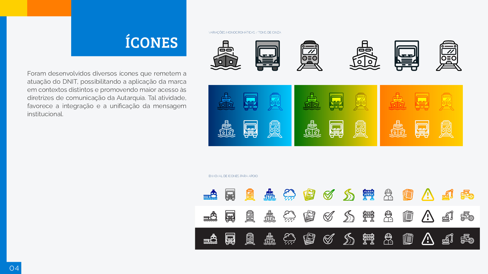
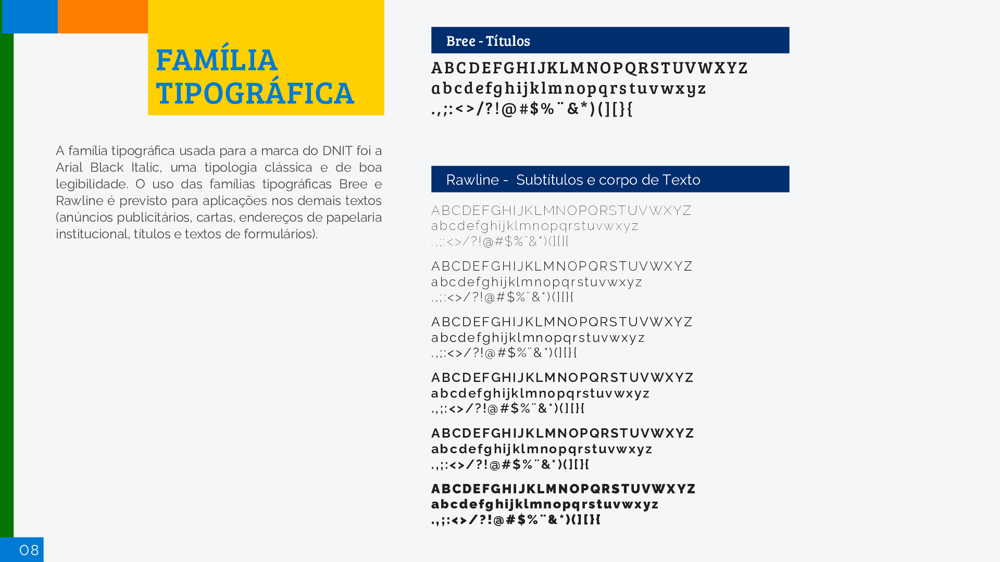
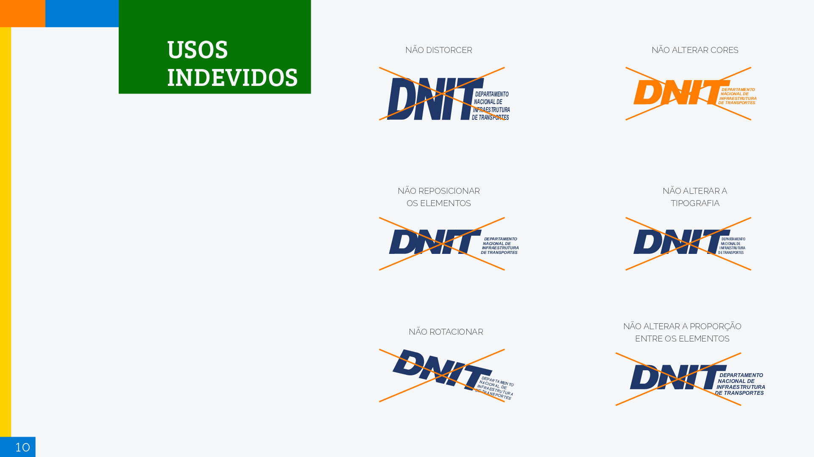
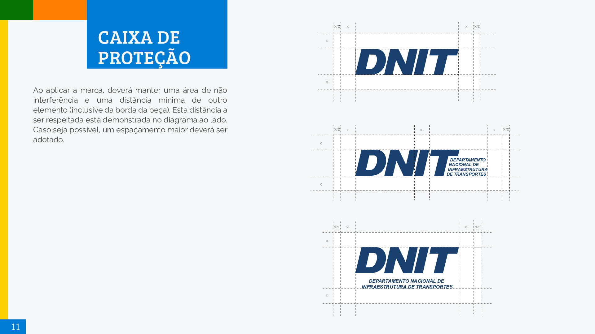
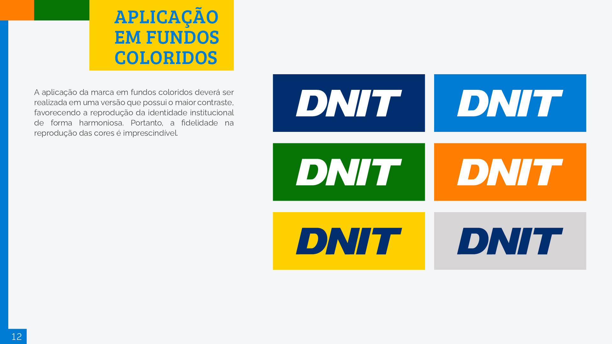
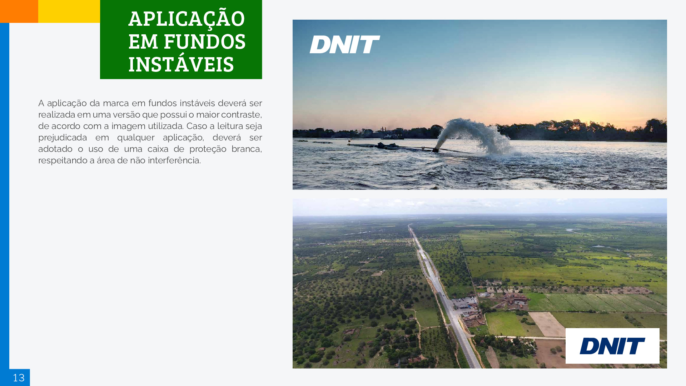
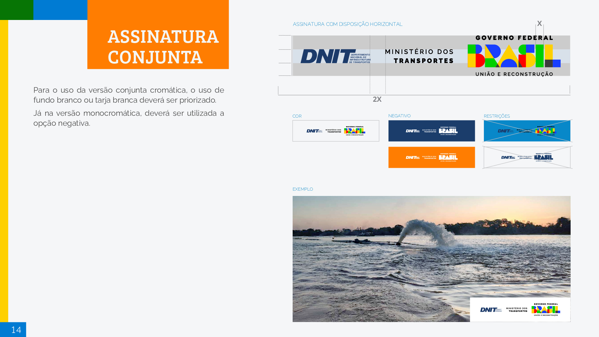
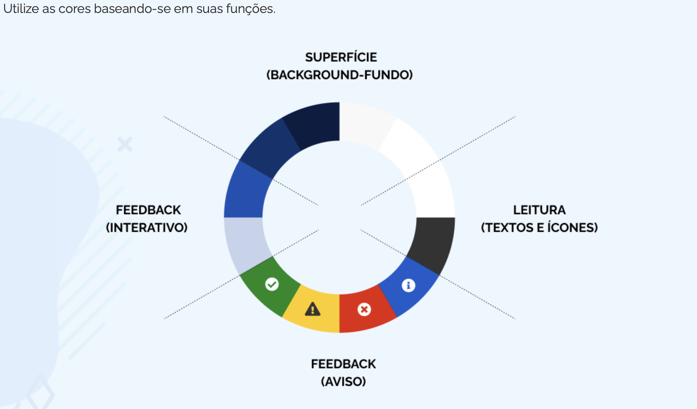

# Identidade Visual

## 1. Introdução

&emsp;&emsp;A identidade visual do projeto possui dois focos de atenção. O primeiro é seguir a identidade visual encontrada no Manual de Gestão de Marca do DNIT, que basicamente nos fornece informações sobre como deve ser aplicada a marca do DNIT em diferentes ocasiões, assim como alguns padrões e regras da marca. O segundo ponto de atenção é referente ao cumprimento do Design System para sites do Governo. Sendo assim, iremos detalhar os principais aspectos de cada um desses tópicos para guiar o desenvolvimento e criação dos designs para as plataformas.

## 2. Manual de Gestão de Marca do DNIT

&emsp;&emsp;A seguir serão apresentados os principais pontos do Manual de Gestão de Marca do DNIT, oferecido pela própria equipe do DNIT.

### 2.1 Conceito

### 2.2 Ícones

### 2.3 Apresentação

### 2.4 Cores

### 2.5 Elementos gráficos

### 2.6 Tipografia

### 2.7 Tamanho da logo

### 2.8 Usos indevidos

### 2.9 Caixa de proteção

### 2.10 Logo em fundos coloridos

### 2.11 Logo em fundos instáveis

### 2.12 Assinatura conjunta

## 3. Padrão Digital de Governo - Design System

&emsp;&emsp;Como conversado e validado em reunião com os representates do DNIT, o projeto deve seguir os padrões estabelecidos por esse Design System. As informações presentes neste documento são referentes à versão 3.4.0.

&emsp;&emsp;A seguir serão apresentados os padrões minímos de uma aplicação Web Responsiva, mas vale ressaltar que existem inúmeras ferramentas de apoio e consulta na documentação presente na [documentação](https://www.gov.br/ds/home). Por conta disso, é aconselhável que seja utilizado como suporte para validar os designs criados para o projeto.

&emsp;&emsp;Dentro do contexto de aplicação Web Responsivo, existem seis pontos de atenção, sendo eles: Cabeçalho, Logo Gov.br, Rodapé, Tipografia, Paleta de Cores e Botões.

### 3.1 Cabeçalho

&emsp;&emsp;Este componente é o principal elemento de uma página, onde podem ser agrupados componentes predefinidos que tem como finalidade auxiliar o usuário no acesso ou mesmo execução das funcionalidades principais site/sistema.

&emsp;&emsp;Existem variações de cabeçalho para adaptação. Os outros estilos podem ser visto na [documentação](https://www.gov.br/ds/components/header?tab=desenvolvedor)

### 3.2 Rodapé

&emsp;&emsp;Geralmente localizado na parte inferior das páginas, o footer (rodapé) pode ser organizado de formas distintas. Normalmente essa organização é definida através da combinação de elementos que reforçam a identidade visual com o conteúdo a ser informado, respeitando os objetivos de negócio e as necessidades do usuário.

&emsp;&emsp;Existe uma variação quanto ao tema que também pode ser utilizada, que no caso o background color é branco. Outras variações, detalhes de como manipular as classes e o estilo do componente oferecido pelo próprio governo podem ser vistos na [documentação](https://www.gov.br/ds/components/footer?tab=desenvolvedor)

### 3.3 Paleta de Cores

&emsp;&emsp;A aplicação correta da paleta de cores visa trazer consistência ao Design System e contribuir para garantir uma interface unificada e facilmente reconhecível pelos seus usuários. É fundamental que a paleta esteja alinhada aos Princípios do Design System e seja aplicada corretamente na biblioteca de componentes contribuindo para o equilíbrio entre os diversos produtos e sistemas do governo.

&emsp;&emsp;Pela [documentação](https://www.gov.br/ds/fundamentos-visuais/cores) é possível ver detalhadamente quais cores devem ser utilizadas e quais as suas funções específicas, portanto é indicado que seja utilizado como guia essas cores para seguir o padrão mínimo esperado

### 3.4 Tipografia

&emsp;&emsp;A tipografia utilizada no Design System é a 'Rawline' utilizando suas diferentes aplicações de peso, o que garante uma hierarquia entre os diferentes textos. Para saber mais detalhes sobre a utilização da tipografia e suas variações, acesse a [documentação](https://www.gov.br/ds/fundamentos-visuais/tipografia)

### 3.5 Iconografia

&emsp;&emsp;A coleção de ícones escolhida pelo Design System do governo é a 'Font Awesome' por possuir uma boa variedade de ícones com layout simples, sintético e amigável

### 3.6 Botões

&emsp;&emsp;Os botões são elementos interativos da interface, que permitem que os usuários acessem funcionalidades, executem ações ou naveguem pela interface.

&emsp;&emsp;Propriedades adicionais, estados do botão e outros detalhes podem ser vistos na [documentação](https://www.gov.br/ds/components/button?tab=desenvolvedor)

## Referências

> EQUIPE DNIT 2023-1. Identidade Visual. Disponível em: <https://fga-eps-mds.github.io/2023-1-Dnit-DOC/identidadeVisual/identidadeVisual/#assinatura-conjunta>

## Versionamento

| Data | Modificação | Autor |
| ---------- | ----------------------------------------- | ---- |
| 04/10/2023 | Criação da pagina e adição do manual de identidade visual fornecido pelo DNIT | Vitor Magalhães Lamego |
| 18/10/2023 | Ajustes de formatação | Daniel Porto |