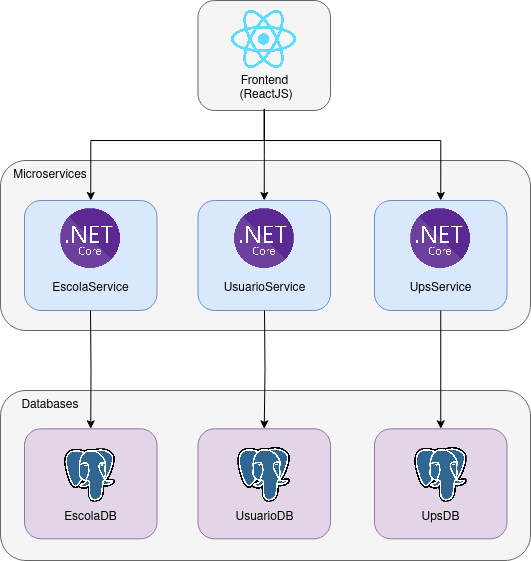

# Manual de Implantação

## Introdução

Este documento tem como objetivo apresentar um guia de como implantar os microserviços usando a ferramenta docker.

A arquitetura em microserviços da aplicação, mais o uso de containers em docker tem alta flexibilidade quanto as opções de implantação. A recomendação é utilizar cada serviço em uma máquina virtual própria, mas também é possível rodar todos em uma mesmo máquina se assim for necessário.

### Dependências

Este guia assume servidores com sistema operacional **linux**, e que estes servidores tem o [Docker](https://docs.docker.com/desktop/install/linux-install/) e o git instalados. Maior parte deste guia deve funcionar no windows também, salvo possíveis adaptações necessárias.



### Banco de Dados

O banco de dados utilizado é o PostgreSQL na versão 16. Cada microserviço tem um banco de dados próprio, que podem ou não estar separados em máquinas virtuais diferentes. É importante que cada microserviço tenha acesso a seu respectivo banco de dados e entre si. Considerando uma única instância do Postgres, crie três bancos de dados com o comando SQL:

```sql
CREATE DATABASE usuariodb;
CREATE DATABASE escoladb;
CREATE DATABASE upsdb;
```

### Backend (UsuarioService, EscolaService e UpsService)

Os microserviços do *backend* tem processos semelhantes para *build* e implantação, diferindo apenas os arquivos de ambiente para cada um.

Dois tipos de arquivo para configuração de ambiente devem ser configurados. O primeiro é o arquivo no caminho `app/appsettings.json` e o segundo é um arquivo `.env`. Eles devem ser configurados antes de realizar a *build*.

Abaixo, seguem os templates dos dois arquivos de ambiente para cada repositório e respectivos comandos para execução.

#### Usuario Service

Clone o repositório:

```shell
git clone https://github.com/fga-eps-mds/2023.2-Dnit-UsuarioService.git
```

mude o diretório para ele:

```shell
cd 2023.2-Dnit-UsuarioService
```

E modifique os arquivos a seguir:

> Obs: "dnit.eps-fga.live" é o domínio que foi utilizado para o ambiente de homologação. Os valores utilizando este domínio estão nos templates como exemplos, e **devem** ser alterados para o novo ambiente.

**app/appsettings.json**

```json
{
    "ConnectionStrings": {
        "PostgreSql": "Host=<>;Port=5432;Database=usuariodb;Username=postgres;Password=<>",
    },
    "Logging": {
        "LogLevel": {
            "Default": "Information",
            "Microsoft.AspNetCore": "Warning"
        }
    },
    "AllowedHosts": "*",
    "Senha": {
        "RedefinirSenhaUrl": "https://dnit.eps-fga.live/redefinirSenha"
    },
    "Auth": {
        "Enabled": true,
        "Key": "chave secreta chave secreta chave secreta chave secreta chave secreta chave secreta",
        "Issuer": "https://usuario.dnit.fga-eps.live/",
        "Audience": "https://usuario.dnit.fga-eps.live/",
        "ValidateIssuer": false,
        "ValidateAudience": false,
        "ValidateIssuerSigningKey": false,
        "ExpireMinutes": 60,
        "RefreshTokenExpireMinutes": 120
    }
}
```

**.env**

```
EMAIL_SERVICE_ADDRESS="USER_NAME"
EMAIL_SERVICE_PASSWORD=""
EMAIL_SERVICE_SMTP=""
```

##### Build

```shell
docker build . -f ci/Dockerfile -t usuario-service
```

##### Execução

```shell
docker run -p 7083:7083 --restart=always usuario-service
```

#### Escola Service

Clone o repositório:

```shell
git clone https://github.com/fga-eps-mds/2023.2-Dnit-EscolaService.git
```

mude o diretório para ele:

```shell
cd 2023.2-Dnit-EscolaService
```

E modifique os arquivos a seguir:

**app/appsettings.json**

```json
{
  "ConnectionStrings": {
    "PostgreSql": "Host=<>;Port=5432;Database=escoladb;Username=postgres;Password=<>",
    "Hangfire": "Host=<>;Port=5432;Database=escoladb;Username=postgres;Password=<>"
  },
  "Logging": {
    "LogLevel": {
      "Default": "Information",
      "Microsoft.AspNetCore": "Warning"
    }
  },
  "AllowedHosts": "*",
  "ApiInepUrl": "http://educacao.dadosabertosbr.com/api/escolas/buscaavancada",
  "Auth": {
    "Enabled": false,
    "Key": "chave secreta chave secreta chave secreta chave secreta chave secreta chave secreta",
    "Issuer": "https://usuario.dnit.fga-eps.live/",
    "Audience": "https://usuario.dnit.fga-eps.live/",
    "ValidateIssuer": false,
    "ValidateAudience": false,
    "ValidateIssuerSigningKey": false,
    "ExpireMinutes": 30,
    "RefreshTokenExpireMinutes": 120
  },
  "UpsServiceConfig": {
    "Host": "http://10.0.0.5:7085/",
    "ApiKey": "Bearer ..."
  },
  "CalcularUpsJobConfig": {
    "ExpiracaoMinutos": -1,
    "TamanhoBatelada": 50
  }
}
```

**.env**

```
EMAIL_SERVICE_ADDRESS="USER_NAME"
EMAIL_SERVICE_PASSWORD=""
EMAIL_SERVICE_SMTP=""
EMAIL_DNIT=""
```

##### Build

```shell
docker build . -f ci/Dockerfile -t escola-service
```

##### Execução

```shell
docker run -p 7084:7084 --restart=always escola-service
```

#### Ups Service

Clone o repositório:

```shell
git clone https://github.com/fga-eps-mds/2023.2-Dnit-UpsService.git
```

mude o diretório para ele:

```shell
cd 2023.2-Dnit-UpsService
```

E modifique os arquivos a seguir:

**app/appsettings.json**

```json
{
    "ConnectionStrings": {
        "PostgreSql": "Host=<>;Port=5432;Database=upsdb;Username=postgres;Password=<>",
    },
    "Logging": {
        "LogLevel": {
          "Default": "Information",
          "Microsoft.AspNetCore": "Warning"
        }
    },
    "AllowedHosts": "*",
    "Auth": {
        "Enabled": false,
        "Key": "chave secreta chave secreta chave secreta chave secreta chave secreta chave secreta",
        "Issuer": "https://usuario.dnit.fga-eps.live/",
        "Audience": "https://usuario.dnit.fga-eps.live/",
        "ValidateIssuer": false,
        "ValidateAudience": false,
        "ValidateIssuerSigningKey": false,
        "ExpireMinutes": 30,
        "RefreshTokenExpireMinutes": 120
    },
    "EscolaServiceConfig": {
        "Host": "http://10.0.0.6:7084"
    }
}
```

*Obs: Este microserviço não utiliza um arquivo .env*

##### Build

```shell
docker build . -f ci/Dockerfile -t ups-service
```

##### Execução

```shell
docker run -p 7085:7085 --restart=always ups-service
```

### Frontend

Clone o repositório:

```shell
git clone https://github.com/fga-eps-mds/2023.2-Dnit-Front.git
```

mude o diretório para ele:

```shell
cd 2023.2-Dnit-Front
```

Adicione e preencha o arquivo `.env`:

**.env**

```
REACT_APP_API_USUARIOS=
REACT_APP_API_ESCOLAS=
REACT_APP_API_UPS=
```

##### Build

```shell
docker build . -f ci/Dockerfile -t dnit-front
```

##### Execução

```shell
docker run -p 8080:80 --restart=always dnit-front
```

## Versionamento

|**Data**|**Descrição**|**Autor(es)**|
|--------|-------------|--------------|
| 15/12/2023 | Criação do documento | Wagner Martins |
