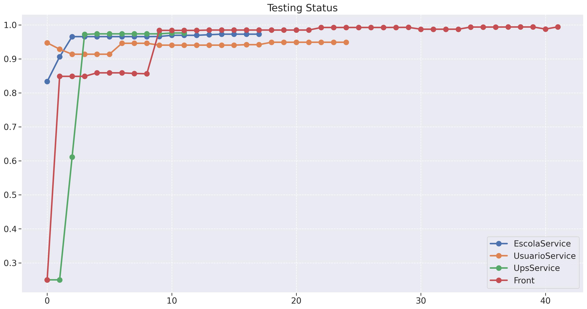
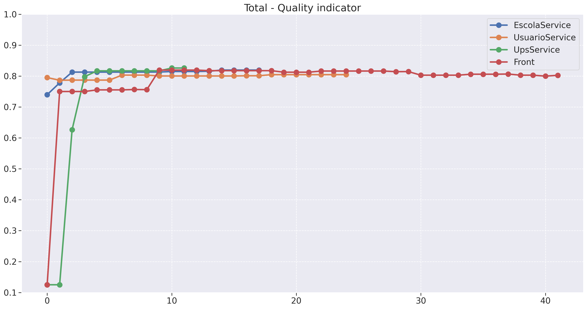

# Planejado X Realizado

## 1. Introdução

Este documento tem como objetivo apresentar a análise comparativa entre o planejamento e a execução no desenvolvimento do projeto. Serão avaliados e comparados o Backlog com as User Stories (US), o Custo, Risco e a Qualidade, a fim de compreender o progresso do projeto.

## 2. Backlog

### 2.1. Planejado

* [Implementar design system do Gov.br](https://github.com/fga-eps-mds/2023.2-Dnit-DOC/issues/66)
* [Configuração do Sonnar](https://github.com/fga-eps-mds/2023.2-Dnit-DOC/issues/46)
* [Refatorar Comunicação com a API](https://github.com/fga-eps-mds/2023.2-Dnit-DOC/issues/38)
* [Refatorar disposição das pastas do front](https://github.com/fga-eps-mds/2023.2-Dnit-DOC/issues/37)
* [Adição de ORM](https://github.com/fga-eps-mds/2023.2-Dnit-DOC/issues/21)
* US1 - [Gerenciar perfis](https://github.com/fga-eps-mds/2023.2-Dnit-DOC/issues/64)
* US2 - [Gerenciar os diferentes tipos de usuários do sistema](https://github.com/fga-eps-mds/2023.2-Dnit-DOC/issues/65)
* US3 - [Gerenciar empresas terceirizadas](https://github.com/fga-eps-mds/2023.2-Dnit-DOC/issues/83)
* US4 - [Ranking de Escolas](https://github.com/fga-eps-mds/2023.2-Dnit-DOC/issues/71)
* US5 - [Configurar pesos dos fatores de priorização](https://github.com/fga-eps-mds/2023.2-Dnit-DOC/issues/84)
* US6 - [Cálculo de Custo logístico](https://github.com/fga-eps-mds/2023.2-Dnit-DOC/issues/74)
* US7 - [Gerenciar solicitações de ações AGUARDANDO_VALIDACAO](https://github.com/fga-eps-mds/2023.2-Dnit-DOC/issues/85)
* US8 - [Gerenciar Ações](https://github.com/fga-eps-mds/2023.2-Dnit-DOC/issues/73)
* US9 - [Exportar Dados](https://github.com/fga-eps-mds/2023.2-Dnit-DOC/issues/75)
* US10 - [Visualização de escolas pelo Google Maps ](https://github.com/fga-eps-mds/2023.2-Dnit-DOC/issues/76)

### 2.2. Executado

* [Adição de ORM](https://github.com/fga-eps-mds/2023.2-Dnit-DOC/issues/21)
* [Implementar design system do Gov.br](https://github.com/fga-eps-mds/2023.2-Dnit-DOC/issues/66)
* [Configuração do Sonnar](https://github.com/fga-eps-mds/2023.2-Dnit-DOC/issues/46)
* [Refatorar Comunicação com a API](https://github.com/fga-eps-mds/2023.2-Dnit-DOC/issues/38)
* [Refatorar disposição das pastas do front](https://github.com/fga-eps-mds/2023.2-Dnit-DOC/issues/37)
* [Configuração de deploy contínuo](https://github.com/fga-eps-mds/2023.2-Dnit-DOC/issues/8)
* US1 - [Gerenciar perfis](https://github.com/fga-eps-mds/2023.2-Dnit-DOC/issues/64)
* US2 - [Gerenciar os diferentes tipos de usuários do sistema](https://github.com/fga-eps-mds/2023.2-Dnit-DOC/issues/65)
* US3 - [Gerenciar empresas terceirizadas](https://github.com/fga-eps-mds/2023.2-Dnit-DOC/issues/83)
* US4 - [Ranking de Escolas](https://github.com/fga-eps-mds/2023.2-Dnit-DOC/issues/71)
* US5 - [Configurar pesos dos fatores de priorização](https://github.com/fga-eps-mds/2023.2-Dnit-DOC/issues/84)
* US6 - [Cálculo de Custo logístico](https://github.com/fga-eps-mds/2023.2-Dnit-DOC/issues/74)
* US7 - [Gerenciar solicitações de ações AGUARDANDO_VALIDACAO](https://github.com/fga-eps-mds/2023.2-Dnit-DOC/issues/85)
* US8 - [Gerenciar Ações](https://github.com/fga-eps-mds/2023.2-Dnit-DOC/issues/73)
* US9 - [Exportar Dados](https://github.com/fga-eps-mds/2023.2-Dnit-DOC/issues/75)
* US10 - [Visualização de escolas pelo Google Maps ](https://github.com/fga-eps-mds/2023.2-Dnit-DOC/issues/76)

### 2.3. Análise

O grupo planejou inicialmente 15 atividades no backlog e conseguiu se organizar para executar todo o planejamento. Destaca-se também a inclusão da atividade de configuração do deploy contínuo. Isso foi necessário para livrar a obrigração do grupo de atualizar o ambiente de homologação manualmente toda vez que fosse desenvolvida uma nova feture.

## 3. User Stories

### 3.1 Planjejado

* US1 - [Gerenciar perfis](https://github.com/fga-eps-mds/2023.2-Dnit-DOC/issues/64)
* US2 - [Gerenciar os diferentes tipos de usuários do sistema](https://github.com/fga-eps-mds/2023.2-Dnit-DOC/issues/65)
* US3 - [Gerenciar empresas terceirizadas](https://github.com/fga-eps-mds/2023.2-Dnit-DOC/issues/83)
* US4 - [Ranking de Escolas](https://github.com/fga-eps-mds/2023.2-Dnit-DOC/issues/71)
* US5 - [Configurar pesos dos fatores de priorização](https://github.com/fga-eps-mds/2023.2-Dnit-DOC/issues/84)
* US6 - [Cálculo de Custo logístico](https://github.com/fga-eps-mds/2023.2-Dnit-DOC/issues/74)
* US7 - [Gerenciar solicitações de ações AGUARDANDO_VALIDACAO](https://github.com/fga-eps-mds/2023.2-Dnit-DOC/issues/85)
* US8 - [Gerenciar Ações](https://github.com/fga-eps-mds/2023.2-Dnit-DOC/issues/73)
* US9 - [Exportar Dados](https://github.com/fga-eps-mds/2023.2-Dnit-DOC/issues/75)
* US10 - [Visualização de escolas pelo Google Maps ](https://github.com/fga-eps-mds/2023.2-Dnit-DOC/issues/76)

### 3.2 Executado

* US1 - [Gerenciar perfis](https://github.com/fga-eps-mds/2023.2-Dnit-DOC/issues/64)
* US2 - [Gerenciar os diferentes tipos de usuários do sistema](https://github.com/fga-eps-mds/2023.2-Dnit-DOC/issues/65)
* US3 - [Gerenciar empresas terceirizadas](https://github.com/fga-eps-mds/2023.2-Dnit-DOC/issues/83)
* US4 - [Ranking de Escolas](https://github.com/fga-eps-mds/2023.2-Dnit-DOC/issues/71)
* US5 - [Configurar pesos dos fatores de priorização](https://github.com/fga-eps-mds/2023.2-Dnit-DOC/issues/84)
* US6 - [Cálculo de Custo logístico](https://github.com/fga-eps-mds/2023.2-Dnit-DOC/issues/74)
* US7 - [Gerenciar solicitações de ações AGUARDANDO_VALIDACAO](https://github.com/fga-eps-mds/2023.2-Dnit-DOC/issues/85)
* **US8** - [Gerenciar Ações](https://github.com/fga-eps-mds/2023.2-Dnit-DOC/issues/73)
* US9 - [Exportar Dados](https://github.com/fga-eps-mds/2023.2-Dnit-DOC/issues/75)
* US10 - [Visualização de escolas pelo Google Maps ](https://github.com/fga-eps-mds/2023.2-Dnit-DOC/issues/76)
* **US11** - [Gerenciar Polos](https://github.com/fga-eps-mds/2023.2-Dnit-DOC/issues/105)

### 3.3 Análise

Ao comparar as USs planejadas com as realizadas, podemos notar uma diferença em relação a uma parte das User Stories (em negrito).

O Backlog inicialmente planejado para o projeto contemplava as funcionalidades como Gerenciar papéis no sistema (USs 1, 2 e 3), ranking de escolas (US4), gerenciar solicitações de ações (US7), exportar dados (US9), ordenar visitas pelo melhor caminho (US6), configuração de prioridades (US5) e gerênciamento de ações (US8)

Vale destacar também que com o andamento do projeto, o cliente identificou uma nova feature essecial para o funcionamento do projeto que era a funcionalidade de gerenciamento de polos (US11). Essa funcionalidade afeta diretamente a US6 pois mudou o cálculo que antes era baseado apenas em superintendencias do DNIT para polos, que são pontos editáveis de localização (latitude e longitude) que o gestor do DNIT considera essencial para calcular o melhor custo logístico.

Entretanto a US8 que está destacada em negrito precisou sofrer alguns ajustes devido à demora na validação do seu protótipo, mudança do entendimento do cliente sobre essa feature ao longo do semestre e tempo reduzido para o desenvolvimento. Isso resultou em um escopo muito grande para um nível de US, então houve a necessidade de quebrá-la em partes menores.

## 4. Custo

### 4.1. Planejado

### 4.2. Executado

### 4.3. Análise

## Tempo

### 5.1. Planejado

### 5.2. Executado

### 5.3. Análise

## 6. Qualidade

### 6.1. Planejado

O nosso grupo planejou melhorar a segurança e robustez do projeto em relação ao semestre passado para facilitar futuras implementações, com menor acoplamento e com alta coesão, tratando os bugs encontrados e sempre levando em conta possives fragilidades. Com uma ampla cobertura de testes em torno de 90%.

### 6.2. Executado

### 6.3. Análise

O grupo manteve a preocupação de manter a cobertura de testes em torno de 90% e uma boa robustez do código. Isso está evidenciado nos gráficos gerados pelo Q-Rapids, uma ferramenta de análise da qualidade do projeto sobre os aspectos de manutenabilidade e confiabilidade. Esses graficos possuem em seu eixo y uma nota que vai de 0 a 1 e quanto mais próximo de 1 melhor é a avaliação do projeto.

## 7. Risco

### 7.1. Tabela de Resumo

<iframe width="700" height="525" src="https://docs.google.com/spreadsheets/d/e/2PACX-1vS_cUBfKXtr-iQssXj1gmYRuSHkpjKGj5wlsiUM7nDlV8a8eq9WRX9CNlWfgBJ1MSapeszGHFQ91zVw/pubhtml?gid=0&single=true"></iframe>

### 7.2. Gráfico de Burndown

<iframe width="600" height="448" seamless frameborder="0" scrolling="no" src="https://docs.google.com/spreadsheets/d/e/2PACX-1vS_cUBfKXtr-iQssXj1gmYRuSHkpjKGj5wlsiUM7nDlV8a8eq9WRX9CNlWfgBJ1MSapeszGHFQ91zVw/pubchart?oid=944010320&format=interactive"></iframe>

## Versionamento

|**Data**|**Descrição**|**Autor(es)**|
|--------|-------------|--------------|
| 09/12/2023 | Criação do documento e item 3 | Rafael |
| 09/12/2023 | Adição do item 2 | Rafael |
| 09/12/2023 | Adição do item 6 | Rafael |
| 09/12/2023 | Adição do item 7 | Rafael |
