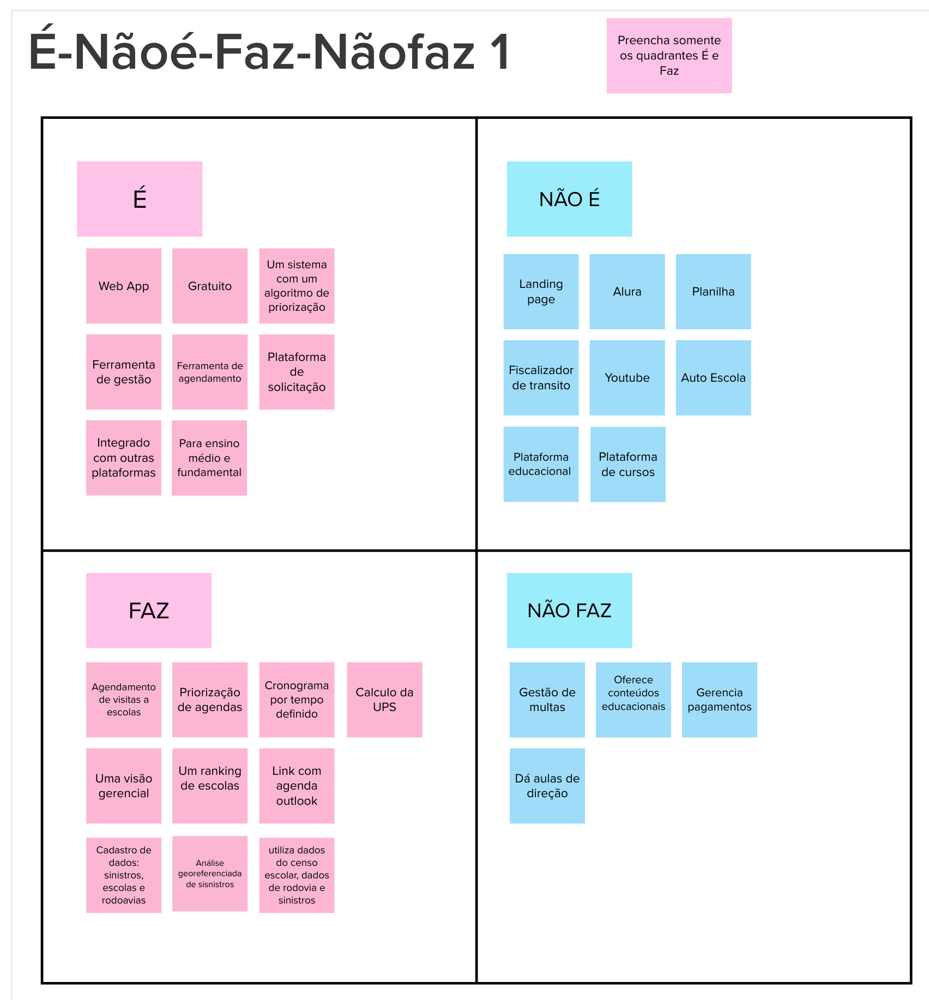
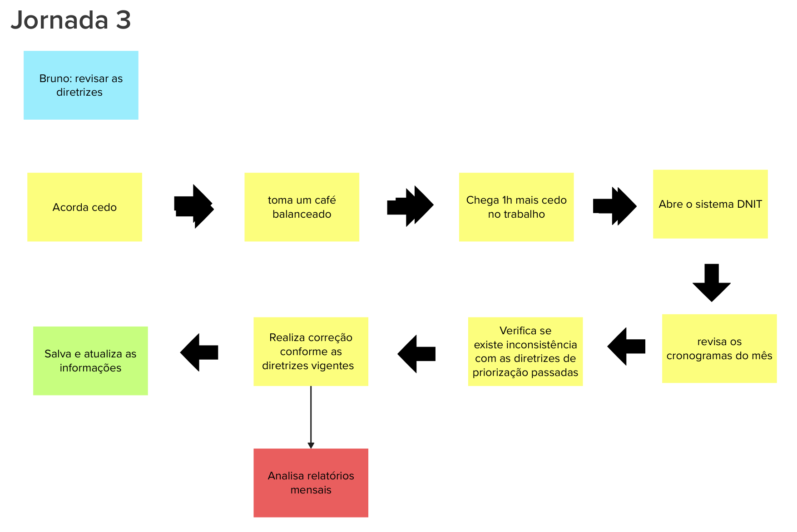
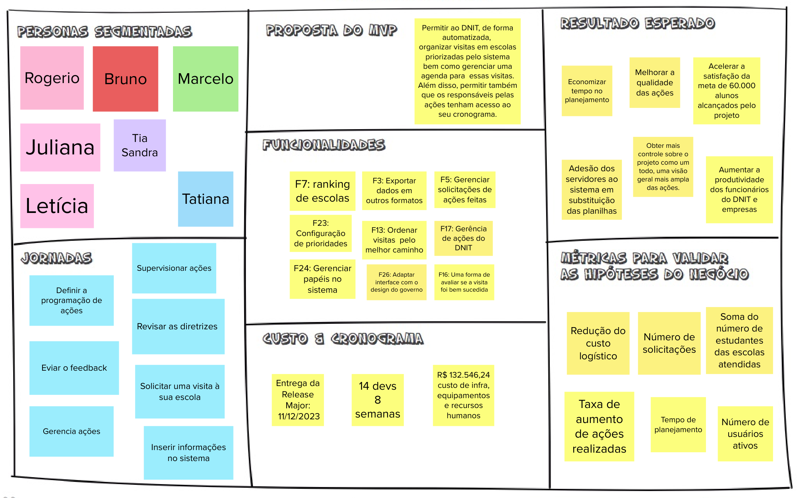

# Lean Inception

## Introdução

A Lean Inception é um workshop colaborativo e dinâmico que ajuda as equipes a alinhar e planejar a criação do Produto Mínimo Viável (MVP). Originada e evoluída a partir de práticas de Design Thinking e Lean Startup, a Lean Inception envolve uma série de atividades estruturadas para facilitar a descoberta, o esclarecimento e a colaboração entre os membros da equipe (CAROLLI, 2018).

Durante o workshop, os participantes trabalham juntos para entender as opções disponíveis, elaborar o MVP e criar um alinhamento sobre os objetivos e expectativas do produto. O resultado é um Canvas MVP que serve como um resumo visual da estratégia do MVP, fornecendo clareza e direção para a equipe avançar na construção do produto (CAROLLI, 2018).

## Kickoff e Agenda

O *Kickoff* é uma reuinão realizada na fase inicial de um projeto com o intuito de alinhar todos os detalhes entre os envolvidos, por exemplo, o cliente e os membros de EPS e MDS.

Nessa etapa foi apresentado o projeto do DNIT e o propósito príncipal para definir o objetivo final a ser alcançado. Para isso, realizou-se uma reunião remota via Microsoft Teams:

* 18/09/2023, durou cerca de 1 hora e 10 minutos.

## Visão do Produto

A etapa de visão do produto na *Lean Inception* é crucial para definir a essência e o direcionamento do produto. Com uma visão clara, é possível determinar as características fundamentais do produto e a estratégia de posicionamento. Essa etapa é estabelecida entre a ideia inicial e o lançamento, servindo como um guia para o desenvolvimento. A visão articula o valor central do negócio e é comunicada de forma clara e convincente para os stakeholders e a equipe de desenvolvimento (CAROLLI, 2018).

## O Produto É - Não é - Faz - Não Faz

A atividade "É - Não é - Faz - Não Faz" é uma técnica utilizada para esclarecer e definir características e funcionalidades de um produto. A ideia é identificar e classificar aspectos positivos e negativos sobre o que o produto é e o que ele faz. Por exemplo, características substantivas ou adjetivas são colocadas na seção "É", enquanto ações ou verbos são colocados na seção "Faz". Esta atividade ajuda a equipe a ter uma visão mais alinhada sobre o produto, esclarecendo o que ele faz e o que não faz, e pode resultar em decisões estratégicas claras (CAROLLI, 2018).

## Objetivos do Negócio

A etapa de Objetivos do Negócio na Lean Inception envolve a identificação e o esclarecimento dos principais objetivos que o produto se propõe a atingir. Os participantes escrevem individualmente três respostas para a pergunta: “Se você tiver que resumir o produto em três objetivos para o negócio, quais seriam eles?”. As respostas são compartilhadas em um canvas comum e agrupadas por similaridade. Depois, a equipe reescreve os objetivos coletivamente, chegando a um consenso sobre o que é crucial para o sucesso do produto. Esse processo garante que todos na equipe tenham um entendimento alinhado dos objetivos do negócio, promovendo clareza e foco nas etapas subsequentes do desenvolvimento do produto (CAROLLI, 2018).

## Personas

Uma Persona é a representação semifictícia do cliente ideal de uma empresa, baseada em dados reais sobre comportamento, características demográficas, motivações, desafios e objetivos. Portanto, o grupo sempre validava em relação ao público alvo do produto de software as personas com os clientes do DNIT.

Nessa etapa de Personas, os participantes são divididos em grupos menores e cada um cria duas ou três personas, descrevendo seus perfis, comportamentos e necessidades específicas. Elas são então apresentadas a todos os participantes, e aquelas que são duplicadas ou muito semelhantes são descartadas. Finalmente, todos votam nas melhores personas para o produto. Este processo ajuda a equipe a entender e empatizar com os usuários finais, garantindo que o produto seja desenvolvido com as necessidades e objetivos dos usuários em mente (CAROLLI, 2018).

Para garantir que as personas representavam bem o público alvo, foi validado sete personas diferentes pelos clientes do DNIT: 

## Jornadas de Usuário

A etapa de Jornadas de Usuário na *Lean Inception* envolve a descrição detalhada do percurso que um usuário faz para alcançar um objetivo específico, mapeando a interação do usuário com o produto. A jornada é descrita passo a passo, com cada passo representando uma ação ou interação específica que a persona realiza para alcançar seu objetivo. As jornadas ajudam a equipe a visualizar e entender como os usuários interagem com o produto de software, identificando oportunidades para melhorar a experiência do usuário e garantir que o produto atenda às suas necessidades e expectativas (CAROLLI, 2018).

Assim, cada uma das personas apresentada na seção anterior possui uma jornada onde também passou por uma etapa de validação pelo cliente do DNIT:

## Brainstorm de Funcionalidades

A etapa de *Brainstorm* de Funcionalidades na *Lean Inception* é uma atividade colaborativa que visa identificar e listar as funcionalidades essenciais para o produto. Utilizando um canvas com os objetivos do negócio como colunas e as personas como linhas, os participantes são incentivados a responder perguntas como "O que deve ter no produto para atender às necessidades da persona?" e "Quais funcionalidades devemos construir para atingir esse objetivo do produto?". As respostas são anotadas em post-its e colocadas no canvas. Esta atividade é repetida para cada combinação de persona e objetivo, priorizando os principais objetivos e personas. O resultado é uma lista de funcionalidades que são essenciais para atender aos objetivos do negócio e às necessidades das personas (CAROLLI, 2018).

## Revisão Técnica (Esforço, Negócio, UX)

A etapa de Revisão Técnica, de Negócio e de UX na Lean Inception é uma fase crítica onde cada funcionalidade proposta é avaliada em termos de esforço técnico, valor para o negócio e experiência do usuário (UX). Utiliza-se um gráfico do semáforo para atribuir cores que representam o nível de confiança na implementação de cada funcionalidade: verde para alta confiança, amarelo para média e vermelho para baixa (CAROLLI, 2018), exemplificados na Figura abaixo.

<figure>
  <figcaption>Fonte: (CAROLLI, 2018, p. 92)</figcaption>
</figure>

Cada funcionalidade é marcada em uma tabela que indica o esforço técnico, valor de negócio e valor de UX em uma escala comparativa. Este processo colaborativo ajuda a equipe a identificar e priorizar funcionalidades, considerando os desafios técnicos, o impacto no negócio e a experiência do usuário, garantindo que o produto desenvolvido seja viável, valioso e utilizável (CAROLLI, 2018).

"Esforço" refere-se ao trabalho necessário para implementar uma funcionalidade específica, sendo classificado em baixo, médio ou alto (representado por "E", "EE" ou "EEE"). "Negócio" está relacionado ao retorno sobre o investimento ou a economia que a funcionalidade trará, também classificado em baixo, médio ou alto (representado por "$", "$$" ou "$$$"). "UX" (Experiência do Usuário) é uma medida de quanto se acredita que os usuários vão gostar da funcionalidade (representado por "<3", "<3<3" ou "<3<3<3" ), avaliada da mesma forma (CAROLLI, 2018).

Seguindo essa lógica apresentada de Esforço, Negócio e UX, o grupo identificou as Funcionalidades da seguinte forma: 

## Sequenciador

A etapa do Sequenciador na Lean Inception é focada em organizar e planejar as entregas do produto, identificando claramente as funcionalidades do MVP (Produto Mínimo Viável) e seus incrementos subsequentes. Utiliza-se um template do sequenciador, que consiste em ondas numeradas, para organizar as funcionalidades de forma que as mais impactantes sejam executadas nas primeiras ondas (CAROLLI, 2018).

Segundo Carolli (2018), as regras para adicionar cartões às ondas no sequenciador são:

1. Uma onda pode conter, no máximo, três cartões.
2. Uma onda não pode conter mais de um cartão vermelho.
3. Uma onda não pode conter três cartões somente amarelos ou vermelhos.
4. A soma de esforço dos cartões não pode ultrapassar cinco "E".
5. A soma de valor dos cartões não pode ser menos de quatro "$" e quatro corações.

Essas regras são aplicadas para garantir um equilíbrio entre o esforço necessário para implementar as funcionalidades, o valor que elas trazem para o negócio e a experiência do usuário. Isso almeja garantir uma entrega incremental eficiente e eficaz do produto, validando hipóteses de negócios e atendendo às necessidades dos usuários (CAROLLI, 2018).

O grupo tomou a decisão de apresentar o tamanho de cada onda a partir de uma média geral que no caso deste projeto foi de 14 dias. Também, a partir desse conjunto de regras, o grupo propôs o seguinte sequenciador para os clientes do DNIT:

**OBS.:** Essa proposta do sequenciador foi validade pelos clientes em uma reunião remota via Teams com os clientes no dia 09/10/2023

## Canvas MVP

De acordo com Carolli (2018), a etapa do Canvas MVP na Lean Inception é dedicada a detalhar e validar a estratégia para o Produto Mínimo Viável (MVP). O Canvas MVP é dividido em sete blocos:

1. Proposta do MVP: Define o que o MVP se propõe a realizar ou validar.;
2. Personas Segmentadas: Identifica o público-alvo específico para o MVP, podendo ser um segmento mais restrito para testes iniciais;
3. Jornadas: Descreve as jornadas de usuário que serão atendidas ou melhoradas com o MVP;
4. Funcionalidades: Lista as funcionalidades que serão construídas para atender às jornadas de usuário e validar as hipóteses do negócio;
5. Resultado Esperado: Define o que a equipe espera alcançar com o MVP em termos de aprendizado ou resultados mensuráveis;
6. Métricas para validar as hipóteses do negócio: Estabelece critérios objetivos e mensuráveis para avaliar se as hipóteses do negócio foram validadas.
7. Custo e Cronograma: Indica qual é o custo e a data previstos para a entrega do MVP;

Assim, o grupo montou o seguinte Canvas MVP:

## Referências

> Caroli, Paulo. Lean Inception: como alinhar pessoas e construir o produto certo – 1ª edição atualizada – São Paulo: Editora Caroli, 2018.

## Versionamento

|**Data**|**Descrição**|**Autor(es)**|
|--------|-------------|--------------|
| 22/10/2023 | Criação do documento | Rafael |
| 22/10/2023 | Documentação de Kickoff, Visao, É não é, Objetivos| Rafael |
| 22/10/2023 | Documentação de Jornadas, Brainstorm, Revisão e Sequenciador | Rafael |
